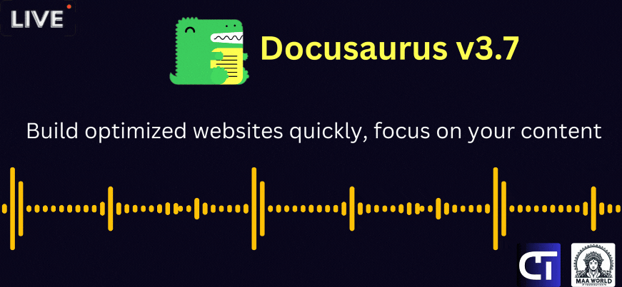

# Docusaurus v3.7 - All In One Resource 🎉

  

  > A curated list of awesome Docusaurus resources

   

## Contributing

We welcome contributions from the community! Whether you're enhancing documentation or adding new resources, your help makes this collection more valuable for everyone. Please check our [Contributing Guidelines](./CONTRIBUTING.md) to get started.
